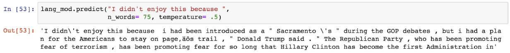

```{r warning=FALSE, message=FALSE}
library(ggplot2)
library(dplyr)
library(keras)
library(purrr)
library(tm)
library(e1071)
library(stringr)
library(SentimentAnalysis)
library(searchable)
library(syuzhet)
library(caret)
library(gridExtra)
library(randomForest)
```

## Process the Data

```{r}
buzzfeed <- read.csv("https://www.macalester.edu/~ajohns24/data/buzzfeed.csv")
```

```{r}
buzzfeed_clean <- buzzfeed %>%
  mutate(text = as.character(text)) %>%
  mutate(title = as.character(title))
```

```{r}
buzzfeed_clean$text  <- gsub("[^0-9A-Za-z/// ]","<>" , buzzfeed_clean$text ,ignore.case = TRUE)
buzzfeed_clean$text <- gsub("<>","" , buzzfeed_clean$text ,ignore.case = TRUE)

buzzfeed_clean$title  <- gsub("[^0-9A-Za-z/// ]","<>" , buzzfeed_clean$title ,ignore.case = TRUE)
buzzfeed_clean$title <- gsub("<>","" , buzzfeed_clean$title ,ignore.case = TRUE)
```

### Define Predictors

#### WordCount

`WordCount`

```{r}
# We use this sentiment function to merely output the number of distinct word counts.
distinct_words <- analyzeSentiment(buzzfeed_clean$text) %>%
  select(WordCount)

buzzfeed_clean <- cbind(buzzfeed_clean, distinct_words)
```

#### Sentiment

Sentiment elements include: `anger`, `anticipation`, `disgust`,  `fear`, `joy`, `sadness`, `surprise`, `trust`, `negative`, `positive`.

```{r}
sentiment <- get_nrc_sentiment(buzzfeed_clean$text)

buzzfeed_clean <- cbind(buzzfeed_clean, sentiment)
```

#### Value manipulation

```{r}
buzzfeed_clean <- buzzfeed_clean %>%
  mutate(text = as.character(text)) %>%
  mutate(text = strsplit(text, "\\s+")) %>%
  mutate(title = as.character(title)) %>%
  mutate(title = strsplit(title, "\\s+"))
```

```{r}
buzzfeed_final <- buzzfeed_clean %>%
  mutate(text_length = lengths(text)) %>%
  mutate(title_length = lengths(title))
```

#### has_Trump

`has_trump`

```{r}
has_trump <- rep(NA, 182)

for (i in 1:182){
  if (sum(buzzfeed_final$title[[i]] == ignore.case("Trump")) > 0){
    has_trump[i] <- TRUE
  } else {
    has_trump[i] <- FALSE
  }
}

buzzfeed_final <- cbind(buzzfeed_final,has_trump) 
```

#### politics

`politics`

```{r}
politics <- rep(NA, 182)

for (i in 1:182){
  politics[i] <- sum(buzzfeed_final$title[[i]] == ignore.case("Trump")) + sum(buzzfeed_final$title[[i]] == ignore.case("Hillary")) + sum(buzzfeed_final$title[[i]] == ignore.case("clinton"))+ sum(buzzfeed_final$title[[i]] == ignore.case("democratic")) + sum(buzzfeed_final$title[[i]] == ignore.case("republican")) + sum(buzzfeed_final$title[[i]] == ignore.case("democratics")) + sum(buzzfeed_final$title[[i]] == ignore.case("republicans")) + sum(buzzfeed_final$title[[i]] == ignore.case("politics")) + sum(buzzfeed_final$title[[i]] == ignore.case("political")) + sum(buzzfeed_final$title[[i]] == ignore.case("president")) + sum(buzzfeed_final$title[[i]] == ignore.case("presidential"))
}

buzzfeed_final <- buzzfeed_final %>%
  mutate(politics = politics/title_length)
  # Select off sentimentGI?
```

#### has_author

`has-author`

```{r}
has_author <- rep(NA,182)

for (i in 1:182){
  if (buzzfeed_final[i,3] == ""){
    has_author[i] <- TRUE
  } else {
    has_author[i] <- FALSE
  }
}

buzzfeed_final <- cbind(buzzfeed_final,has_author) 
```

### Finish Cleaning Up

#### Manipulate in proportion of text length

```{r}
for (i in 1:182){
  for (j in 7:17){
    buzzfeed_final[i,j] <- buzzfeed_final[i,j]/buzzfeed_final[i,18]
  }
}
```

#### Kick out title, text, url, authors

```{r}
buzzfeed_final <- buzzfeed_final[,-c(1:4)]
```

### Predictors in Action


### Drawbacks of Text Analysis

Natural language processing and text analysis is much harder than numerical analysis, for many reasons. It’s hard to get machines to recognize context and ‘read’ words like we do, given they don’t have the years of experience in a language!

It’s also hard to simply use a sentiment dictionary, given words can be dependent on each other (‘I’m so damn mad” vs “I’m so damn happy”). As a result, these approaches still do not come close to the language processing abilities of a human, but we are impressed by the high levels of accuracy we were able to achieve regardless. 

## Analyze

Given this kind of novel data type we are working with, we decided to seek through our toolbox in classifying real and fake news. These include trees/forests, Naive Bayes classfier and ULMFiT, a deep learning approach. 

### Trees/Forests


### Naive Bayes Classfier


```{r include=FALSE}
library(ggplot2)
library(dplyr)
library(keras)
library(purrr)
library(tm)
library(e1071)
library(stringr)
library(SentimentAnalysis)
library(searchable)
library(syuzhet)
library(caret)
library(tidytext)
```


##Data Cleaning and Processing (FED)

```{r include=FALSE}
data<-read.csv("https://www.macalester.edu/~ajohns24/data/buzzfeed.csv")
```

```{r include=FALSE}
data$text<-as.character(data$text)

article_words_no_stopwords <- data %>%
  unnest_tokens(word, text) %>%
  anti_join(stop_words)%>%
  count(type,title, word, sort = TRUE)
```

```{r include = FALSE}
##Group by title or do you group by the whole set of real and fake 

total_words <- article_words_no_stopwords %>% 
  group_by(title) %>% 
  summarize(total = sum(n))

article_words_no_stopwords <- left_join(article_words_no_stopwords, total_words)
article_words_no_stopwords

freq_by_rank <- article_words_no_stopwords %>% 
  group_by(title) %>% 
  mutate(rank = row_number(), 
         term_frequency = n/total)

freq_by_rank


article_words <- article_words_no_stopwords %>%
  bind_tf_idf(word, title, n)

article_words
```

###Picking top 500 words that are most common in fake articles and top 500 words that are most common in real 
```{r}
top_500_fake<-article_words%>%
  group_by(word,type)%>%
  summarize(n = sum(n))%>%
  arrange(desc(n))%>%
  filter(type == "fake")%>%
  head(500)

top_500_real<-article_words%>%
  group_by(word,type)%>%
  summarize(n = sum(n))%>%
  arrange(desc(n))%>%
  filter(type == "real")%>%
  head(500)
  
top_words<-rbind(top_500_fake,top_500_real)

top_words<-top_words%>%
  select(word)

nrow(top_words)

top_words_new<- unique(top_words)

nrow(top_words_new)
```

#TF_IDF

```
The Tf-idf approach assumes that the importance of a word is inversely proportional to how often it occurs across all documents.In the case of naive Bayes classifiers and text classification, large differences in performance can be attributed to the choices of stop word removal, stemming, and token-length (number of word pairings we are looking into).
```

```{r}
library(tidyverse)
new<-article_words%>%select(-c(n,total,tf,idf))
colnames(new)<-c("real/fake","Article_Title","word","tf_idf")

all_words<-
  new%>%
  spread(key = word,tf_idf, fill=0)

bayes<-new%>%
  semi_join(top_words_new,by = c("word","word"))

bayes

words_bayes<-
  bayes%>%
  spread(key = word,tf_idf, fill=0)

words_bayes
```


```{r include = FALSE}
library(wordcloud)
library(wordcloud2)

word_cloud_fake<-new%>%
  filter(`real/fake` == "fake")%>%
  arrange(desc(tf_idf))
word_cloud_real<-new%>%
  filter(`real/fake` == "real")%>%
  arrange(desc(tf_idf))
```

```{r}
fake<-word_cloud_fake%>%
  select(word,tf_idf)

real<-word_cloud_real%>%
  select(word,tf_idf)

wordcloud2(fake)
```

```{r}
wordcloud2(real)
```

```
From what we can see from the word clouds we can see a difference between real and fake articles. The most prevalent words differ alot. We also see that from the real articles words tend to be more frequent like the presidnetial candidates like mccain, ryan, cruz, and other political terms such as veto and irs. And also sites such as abc, make us classify if the texts are real or fake 

But for the fake articles, words tend to be less common among the articles. And words that are more common in fake articles tend to be part of popular culture like harambe. The website word seems to be common but it is particular to some articles that displayed website mainteinance because there was a failure with the website.  
```


##Naive Bayes Model

```
For naive Bayes classifiers, we assume that all the words are independent of each other. And after we do this, we multiply the probability of each word happening given that something is fake news or not. Using this the classifier identifies whether it is fake news or real news based on the probability at the end. If the probability is higher for fake news we classify the article to be fake. 
```

```
For example, if we look at the article "'Reporters' FLEE When Clintons Get EXPOSED!", we can see that the article includes the words c(bad, clintons and claims) In this naive bayes classifier, our classifier will put certain weights to these words to whether they are more likely to be a real or a fake article. Lets say for example that the probability P(fake|article has bad) = 0.5, P(fake|article has clintons) = 0.7 , and P(fake|article has claims) = 0.1 | P(real|article has bad) = 0.1, P(real has clintons) = 0.3 , and P(real|article has claims) = 0.5. Then our naive bayes classifier will multiply all these probabilities P(fake)= 0.5*0.7*0.1 and P(real) = 0.1*0.3*0.5, and because P(fake)>P(real), our naive bayes classifier classifies this article to be fake. 
```

```
There are many different ways to do a naive bayes classifier, we could have done groupings of words instead of just one word. This could give us a better understanding of the sentiment as words such as "bad and worse" carry a negative sentiment if paired up with other words like "not bad" or "not worse", they change the meaning completelly. But this type of classifier is hard when there are not a lot of words in the article, because 
```


```{r}
library(e1071)
Naive_Bayes_Model= naiveBayes(`real/fake`~.-Article_Title,data =words_bayes)


pred <- predict(Naive_Bayes_Model, all_words)
table(pred, all_words$`real/fake`)
```

##Discuss potential drawbacks of text analysis.

### ULMFiT

This technique works in 2 steps. We first only used the article text to train a LSTM language model, a type of neural network developed to try and predict the next words in a sentence. This allowed our language model’s encoder to become a ‘domain expert’ on political news. 

This encoder (mathematical representation of text) is then used to make our classifier, a different neural network, allowing our classifier to ‘read’ the body of text when determining a real/fake classification. The classifier was trained using the article text, title, and all other default columns given in the buzzfeed.csv. 

An 80:20 train/test split was used, as well as the default levels of regularization techniques, to try and prevent severe overfitting (dropout, weight decay) in the model. 

The levels of dropout, the structure of the language model / classifier, and the process of transfer learning in NLP can all be found in fast.ai’s lesson 4 on NLP. 

More information is in the **appendix**. 


## Summarize


## Contributions


## Appendix

1. More information on KNN algorithms:


2. More information on ULMFiT:

The model first builds a dictionary of the 100 most common words, then tokenizes them, as well as cleans any special symbols. The language model is trained to help the classifier general ‘domain knowledge’ (e.g, how fake and real political articles are generally written). This part of the model, the encoder, is then transplanted into the classifier via transfer learning. From here it’s as simple as using a good loss function to help the model improve test set accuracy. Here’s an example of some text generated by the language model given a prompt: 

