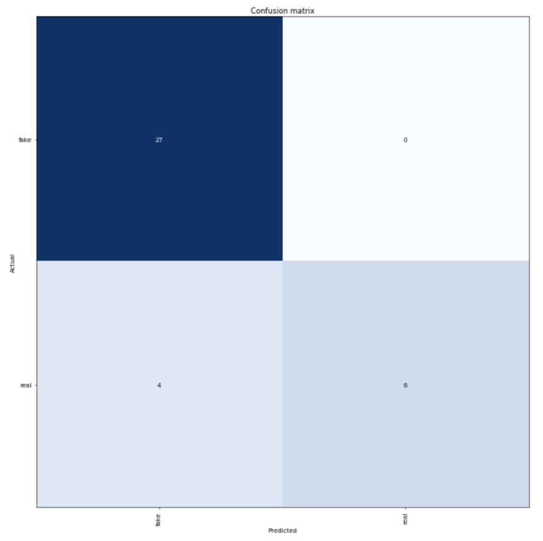

## Starting to Roll

```{r warning=FALSE, message=FALSE}
library(ggplot2)
library(tidyverse)
library(keras)
library(purrr)
library(tm)
library(e1071)
library(stringr)
library(SentimentAnalysis)
library(searchable)
library(syuzhet)
library(caret)
library(gridExtra)
library(randomForest)
library(tidytext)
library(wordcloud)
library(wordcloud2)
```

```{r}
buzzfeed <- read.csv("https://www.macalester.edu/~ajohns24/data/buzzfeed.csv")
```

### Spoiler Alert

Given this kind of novel data type we are working with, we decided to seek through our toolbox in classifying real and fake news. These include trees/forests, Naive Bayes classfier and ULMFiT, a deep learning approach. 

### Drawbacks of Text Analysis

Natural language processing and text analysis is much harder than numerical analysis, for many reasons. It’s hard to get machines to recognize context and ‘read’ words like we do, given they don’t have the years of experience in a language! It’s also hard to simply use a sentiment dictionary, given words can be dependent on each other (‘I’m so damn mad” vs “I’m so damn happy”). As a result, these approaches still do not come close to the language processing abilities of a human, but we are impressed by the high levels of accuracy we were able to achieve regardless. 

## Tool 1: Trees and Forests

### Data Cleaning and Processing

```{r}
buzzfeed_clean <- buzzfeed %>%
  mutate(text = as.character(text)) %>%
  mutate(title = as.character(title))
```

```{r}
buzzfeed_clean$text  <- gsub("[^0-9A-Za-z/// ]","<>" , buzzfeed_clean$text ,ignore.case = TRUE)
buzzfeed_clean$text <- gsub("<>","" , buzzfeed_clean$text ,ignore.case = TRUE)

buzzfeed_clean$title  <- gsub("[^0-9A-Za-z/// ]","<>" , buzzfeed_clean$title ,ignore.case = TRUE)
buzzfeed_clean$title <- gsub("<>","" , buzzfeed_clean$title ,ignore.case = TRUE)
```

`WordCount`

```{r}
# This sentiment function outputs the number of distinct word counts.
distinct_words <- analyzeSentiment(buzzfeed_clean$text) %>%
  select(WordCount)

buzzfeed_clean <- cbind(buzzfeed_clean, distinct_words)
```

`Sentiment`

Sentiment elements include: `anger`, `anticipation`, `disgust`,  `fear`, `joy`, `sadness`, `surprise`, `trust`, `negative`, `positive`, that were all added to buzzfeed_clean. This is in addition to a column where we tracked mentions of political figures (`has_trump`,`politics`) (Trump, Clinton, the republican party), as well as if the article had an author, and the number of distinct word counts `text_length`, `has_author`. 

```{r}
sentiment <- get_nrc_sentiment(buzzfeed_clean$text)

buzzfeed_clean <- cbind(buzzfeed_clean, sentiment)
```

```{r}
buzzfeed_clean <- buzzfeed_clean %>%
  mutate(text = as.character(text)) %>%
  mutate(text = strsplit(text, "\\s+")) %>%
  mutate(title = as.character(title)) %>%
  mutate(title = strsplit(title, "\\s+"))
```

```{r}
buzzfeed_final <- buzzfeed_clean %>%
  mutate(text_length = lengths(text)) %>%
  mutate(title_length = lengths(title))
```

`has_trump`

```{r}
has_trump <- rep(NA, 182)

for (i in 1:182){
  if (sum(buzzfeed_final$title[[i]] == ignore.case("Trump")) > 0){
    has_trump[i] <- TRUE
  } else {
    has_trump[i] <- FALSE
  }
}

buzzfeed_final <- cbind(buzzfeed_final,has_trump) 
```

`politics`

```{r}
politics <- rep(NA, 182)

for (i in 1:182){
  politics[i] <- sum(buzzfeed_final$title[[i]] == ignore.case("Trump")) + sum(buzzfeed_final$title[[i]] == ignore.case("Hillary")) + sum(buzzfeed_final$title[[i]] == ignore.case("clinton"))+ sum(buzzfeed_final$title[[i]] == ignore.case("democratic")) + sum(buzzfeed_final$title[[i]] == ignore.case("republican")) + sum(buzzfeed_final$title[[i]] == ignore.case("democratics")) + sum(buzzfeed_final$title[[i]] == ignore.case("republicans")) + sum(buzzfeed_final$title[[i]] == ignore.case("politics")) + sum(buzzfeed_final$title[[i]] == ignore.case("political")) + sum(buzzfeed_final$title[[i]] == ignore.case("president")) + sum(buzzfeed_final$title[[i]] == ignore.case("presidential"))
}

buzzfeed_final <- buzzfeed_final %>%
  mutate(politics = politics/title_length)
  # Select off sentimentGI?
```

`has_author`

```{r}
has_author <- rep(NA,182)

for (i in 1:182){
  if (buzzfeed_final[i,3] == ""){
    has_author[i] <- TRUE
  } else {
    has_author[i] <- FALSE
  }
}

buzzfeed_final <- cbind(buzzfeed_final,has_author) 
```

#### Further manipulation

```{r}
for (i in 1:182){
  for (j in 7:17){
    buzzfeed_final[i,j] <- buzzfeed_final[i,j]/buzzfeed_final[i,18]
  }
} # Manipulate in proportion of text length
```

```{r}
buzzfeed_final <- buzzfeed_final[,-c(1:4)] # Kick out title, text, url, authors
```

### Predictors in Action

### Build the Algorithms

```{r}
set.seed(253)

tunegrid <- expand.grid(.mtry = c(2,4,9,16))

forest_model_1 <- train(
    type ~ .,
    data = buzzfeed_final,
    method = "rf", 
    trControl = trainControl(method = "cv", number = 10, selectionFunction = "best"),
    tuneGrid = tunegrid,
    metric = "Accuracy",
    na.action = na.omit
)
```

```{r}
plot(forest_model_1)
```

```{r}
forest_model_1$results %>%
  filter(mtry == forest_model_1$finalModel$mtry) %>%
  summarize(Accuracy)
```

```{r}
variable_importance <- data.frame(importance(forest_model_1$finalModel)) %>% 
  mutate(predictor = rownames(.))

# Arrange predictors by importance (most to least)
variable_importance %>% 
  arrange(desc(MeanDecreaseGini)) %>% 
  head()

# Arrange predictors by importance (least to most)
variable_importance %>% 
  arrange(MeanDecreaseGini) %>% 
  head()
```

According to our randomforest model, here's some of the most important variables. Interestingly, they're all sources!

```{r}
variable_importance %>% 
  arrange(desc(MeanDecreaseGini)) %>% 
  head()
```

It seems as though politico and cnn are reputable sources. It's also interesting that our feature engineered Word Count and title_length appear as well. 

Here are some of the least important variables for classification, as a comparison: 

```{r}
variable_importance %>% 
  arrange(MeanDecreaseGini) %>% 
  head()
```

Again, all source links - I guess the evidence seems to suggest that if a news article from a certain domain is fake, others from that domain will tend to be fake as well. 

## Tool 2: Naive Bayes Classifier

### Data Cleaning and Manipulation

```{r}
data$text <- as.character(data$text)

article_words_no_stopwords <- data %>%
  unnest_tokens(word, text) %>%
  anti_join(stop_words)%>%
  count(type,title, word, sort = TRUE)
```

```{r}
##Group by title or do you group by the whole set of real and fake 

total_words <- article_words_no_stopwords %>% 
  group_by(title) %>% 
  summarize(total = sum(n))

article_words_no_stopwords <- left_join(article_words_no_stopwords, total_words)
article_words_no_stopwords

freq_by_rank <- article_words_no_stopwords %>% 
  group_by(title) %>% 
  mutate(rank = row_number(), 
         term_frequency = n/total)

article_words <- article_words_no_stopwords %>%
  bind_tf_idf(word, title, n)
```


For faster analysis and decreased computation time, we made a dictionary of only the 500 most common words. 

```{r}
top_500_fake <- article_words %>%
  group_by(word,type) %>%
  summarize(n = sum(n)) %>%
  arrange(desc(n)) %>%
  filter(type == "fake") %>%
  head(500)

top_500_real <- article_words %>%
  group_by(word,type) %>%
  summarize(n = sum(n)) %>%
  arrange(desc(n)) %>%
  filter(type == "real") %>%
  head(500)
  
top_words <- rbind(top_500_fake,top_500_real)

top_words <- top_words %>%
  select(word)

top_words_new<- unique(top_words)

```

```{r}
new <- article_words%>%select(-c(n,total,tf,idf))
colnames(new) <- c("real/fake","Article_Title","word","tf_idf")

all_words <-
  new %>%
  spread(key = word,tf_idf, fill=0)

bayes <- new %>%
  semi_join(top_words_new,by = c("word","word"))

words_bayes <-
  bayes %>%
  spread(key = word,tf_idf, fill=0)

```

```{r}
real <- words_bayes %>%
  filter(`real/fake` == "real")

fake <- words_bayes[1,]

fake[, colSums(fake != 0) > 0]

real <- real[1,]

real[, colSums(real !=0)>0]
```

## Tool 3: TF_IDF

The Tf-idf approach assumes that the importance of a word is inversely proportional to how often it occurs across all documents.In the case of naive Bayes classifiers and text classification, large differences in performance can be attributed to the choices of stop word removal, stemming, and token-length (number of word pairings we are looking into).

This technique works in 2 steps. We first only used the article text to train a LSTM language model, a type of neural network developed to try and predict the next words in a sentence. This allowed our language model’s encoder to become a ‘domain expert’ on political news. 

This encoder (mathematical representation of text) is then used to make our classifier, a different neural network, allowing our classifier to ‘read’ the body of text when determining a real/fake classification. The classifier was trained using the article text, title, and all other default columns given in the buzzfeed.csv. 

An 80:20 train/test split was used, as well as the default levels of regularization techniques, to try and prevent severe overfitting (dropout, weight decay) in the model. 

The levels of dropout, the structure of the language model / classifier, and the process of transfer learning in NLP can all be found in fast.ai’s lesson 4 on NLP. 

More information is in the **appendix**. 

```{r}
word_cloud_fake <- new% >%
  filter(`real/fake` == "fake") %>%
  arrange(desc(tf_idf))

word_cloud_real <- new %>%
  filter(`real/fake` == "real") %>%
  arrange(desc(tf_idf))
```

```{r}
fake <- word_cloud_fake %>%
  select(word,tf_idf)

real <- word_cloud_real %>%
  select(word,tf_idf)

wordcloud2(fake)
wordcloud2(real)
```

From what we can see from the word clouds we can see a difference between real and fake articles. The most prevalent words differ alot. We also see that from the real articles words tend to be more frequent like the presidnetial candidates like mccain, ryan, cruz, and other political terms such as veto and irs. And also sites such as abc, make us classify if the texts are real or fake 

But for the fake articles, words tend to be less common among the articles. And words that are more common in fake articles tend to be part of popular culture like harambe. The website word seems to be common but it is particular to some articles that displayed website mainteinance because there was a failure with the website.  

**ULMFiT Confusion Matrix**


As you can see, both models performed very well in correctly classifying fake news as fake. It's evident that the Naive Bayes model predicted more real news as real compared to ULMFiT, but Naive Bayes did not utilize a test set, while ULMFiT did. In this case, it's evident that Naive Bayes would be the production model of choice, given lower computational requirements and complexity, but it's interesting to see how the deep learning approach fared. 


## Summarize


## Contributions


## Appendix

1. More information on KNN algorithms:


2. More information on ULMFiT:

The model first builds a dictionary of the 100 most common words, then tokenizes them, as well as cleans any special symbols. The language model is trained to help the classifier general ‘domain knowledge’ (e.g, how fake and real political articles are generally written). This part of the model, the encoder, is then transplanted into the classifier via transfer learning. From here it’s as simple as using a good loss function to help the model improve test set accuracy. Here’s an example of some text generated by the language model given a prompt: 

