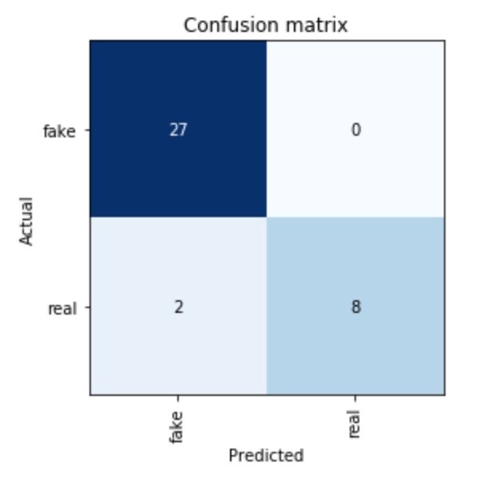

## Starting to Roll

```{r warning=FALSE, message=FALSE}
library(ggplot2)
library(tidyverse)
library(keras)
library(purrr)
library(tm)
library(e1071)
library(stringr)
library(SentimentAnalysis)
library(searchable)
library(syuzhet)
library(caret)
library(gridExtra)
library(randomForest)
library(tidytext)
library(wordcloud)
library(wordcloud2)
```

```{r}
buzzfeed <- read.csv("https://www.macalester.edu/~ajohns24/data/buzzfeed.csv")
```

### Spoiler Alert

Given this kind of novel data type we are working with, we decided to seek through our toolbox in classifying real and fake news. These include trees/forests, Naive Bayes classfier and ULMFiT, a deep learning approach. 

Unfortunately, each of these algorithms takes in a different data format, meaning that you would expect a distinct data manipulation section in each of our tools respectively. 

Defining predictors is more compatible with the trees/forests algorithms, where the algorithms take in predictors. The other approaches take in more original texts

### Drawbacks of Text Analysis

Natural language processing and text analysis is much harder than numerical analysis, for many reasons. It’s hard to get machines to recognize context and ‘read’ words like we do, given they don’t have the years of experience in a language!

It’s also hard to simply use a sentiment dictionary, given words can be dependent on each other (‘I’m so damn mad” vs “I’m so damn happy”). As a result, these approaches still do not come close to the language processing abilities of a human, but we are impressed by the high levels of accuracy we were able to achieve regardless. 

## Tool 1: Trees and Forests

### Data Cleaning and Processing

```{r}
buzzfeed_clean <- buzzfeed %>%
  mutate(text = as.character(text)) %>%
  mutate(title = as.character(title))
```

```{r}
buzzfeed_clean$text  <- gsub("[^0-9A-Za-z/// ]","<>" , buzzfeed_clean$text ,ignore.case = TRUE)
buzzfeed_clean$text <- gsub("<>","" , buzzfeed_clean$text ,ignore.case = TRUE)

buzzfeed_clean$title  <- gsub("[^0-9A-Za-z/// ]","<>" , buzzfeed_clean$title ,ignore.case = TRUE)
buzzfeed_clean$title <- gsub("<>","" , buzzfeed_clean$title ,ignore.case = TRUE)
```

`WordCount`: The number of distinct words in a news article

```{r}
# This sentiment function outputs the number of distinct word counts.
distinct_words <- analyzeSentiment(buzzfeed_clean$text) %>%
  select(WordCount)

buzzfeed_clean <- cbind(buzzfeed_clean, distinct_words)
```

`Sentiment`

Sentiment elements include: `anger`, `anticipation`, `disgust`,  `fear`, `joy`, `sadness`, `surprise`, `trust`, `negative`, `positive`, that were all added to buzzfeed_clean. This is in addition to a column where we tracked mentions of political figures (`has_trump`,`politics`) (Trump, Clinton, the republican party), as well as if the article had an author, and the number of distinct word counts `text_length`, `has_author`. 

```{r}
sentiment <- get_nrc_sentiment(buzzfeed_clean$text)

buzzfeed_clean <- cbind(buzzfeed_clean, sentiment)
```

```{r}
buzzfeed_clean <- buzzfeed_clean %>%
  mutate(text = as.character(text)) %>%
  mutate(text = strsplit(text, "\\s+")) %>%
  mutate(title = as.character(title)) %>%
  mutate(title = strsplit(title, "\\s+"))
```

```{r}
buzzfeed_final <- buzzfeed_clean %>%
  mutate(text_length = lengths(text)) %>%
  mutate(title_length = lengths(title))
```

`has_trump`: Whether the title contains the word `Trump`

```{r}
has_trump <- rep(NA, 182)

for (i in 1:182){
  if (sum(buzzfeed_final$title[[i]] == ignore.case("Trump")) > 0){
    has_trump[i] <- TRUE
  } else {
    has_trump[i] <- FALSE
  }
}

buzzfeed_final <- cbind(buzzfeed_final,has_trump) 
```

`politics`: The number of times that the title contains politics-related words

```{r}
politics <- rep(NA, 182)

for (i in 1:182){
  politics[i] <- sum(buzzfeed_final$title[[i]] == ignore.case("Trump")) + sum(buzzfeed_final$title[[i]] == ignore.case("Hillary")) + sum(buzzfeed_final$title[[i]] == ignore.case("clinton"))+ sum(buzzfeed_final$title[[i]] == ignore.case("democratic")) + sum(buzzfeed_final$title[[i]] == ignore.case("republican")) + sum(buzzfeed_final$title[[i]] == ignore.case("democratics")) + sum(buzzfeed_final$title[[i]] == ignore.case("republicans")) + sum(buzzfeed_final$title[[i]] == ignore.case("politics")) + sum(buzzfeed_final$title[[i]] == ignore.case("political")) + sum(buzzfeed_final$title[[i]] == ignore.case("president")) + sum(buzzfeed_final$title[[i]] == ignore.case("presidential"))
}

buzzfeed_final <- buzzfeed_final %>%
  mutate(politics = politics/title_length)
  # Select off sentimentGI?
```

`has_author`: Whether the article has an author

```{r}
has_author <- rep(NA,182)

for (i in 1:182){
  if (buzzfeed_clean[i,4] == ""){
    has_author[i] <- FALSE
  } else {
    has_author[i] <- TRUE
  }
}

buzzfeed_final <- cbind(buzzfeed_final,has_author) 
```

#### Further manipulation

A lot of predictors we have (e.g. the number of happy words) is largely influenced by the article length. To account for the length, we manipulate variables in proportion of text length.

```{r}
for (i in 1:182){
  for (j in 7:17){
    buzzfeed_final[i,j] <- buzzfeed_final[i,j]/buzzfeed_final[i,18]
  }
}
```

```{r}
buzzfeed_final <- buzzfeed_final[,-c(1:4)] # Kick out title, text, url, authors
```

### Predictors in Action

To see our predictors in action, let's find one real article and one fake article to see how our predictors might work.

#### Real article

```{r}
buzzfeed[10,]$title
```

```{r}
buzzfeed_final[10,]
```

#### Fake article

```{r}
buzzfeed[101,]$title
```

```{r}
buzzfeed_final[101,]
```

As we compare the fake and real article one standout difference between both of them is that the real article contains an author, and the fake article doesn't contain an author. This shows us that if the article was real, then we would expect to see authors in the text. The fake article is also considerably short with only 143 words compared to the real article with 1610 words. 

### Build the Tree

```{r}
set.seed(253)

tree_model_1 <- train(
  type ~ .,
  data = buzzfeed_final,
  method = "rpart",
  tuneGrid = data.frame(cp = seq(0, 0.2, length = 60)),
  trControl = trainControl(method = "cv", number = 10, selectionFunction = "best"),
  metric = "Accuracy",
  na.action = na.omit
)
```

```{r}
plot(tree_model_1)
```

```{r}
tree_model_1$results %>%
  filter(cp == tree_model_1$bestTune$cp) %>%
  summarize(Accuracy)
```

```{r}
variable_importance_tree <- data.frame(varImp(tree_model_1$finalModel)) %>% 
  mutate(predictor = rownames(.))

# Arrange predictors by importance (most to least)
variable_importance_tree %>% 
  arrange(desc(Overall)) %>% 
  head()

# Arrange predictors by importance (least to most)
variable_importance_tree %>% 
  arrange(Overall) %>% 
  head()
```

Politico and cnn seem to be reputable sources (fortunately!). It's also interesting that our feature engineered Word Count and title_length appear as well.

Regarding the least important predictors, we presume that evidence seems to suggest that if a news article from a certain domain is fake, others from that domain will tend to be fake as well. This makes intuitive sense since some sources are known for fake stories!

### Build the Forest

Given the total number of 16 predictors, we tuned our forest model with the number of randomly selected predictors to be $2$, $\sqrt{16} = 4$, $\frac{16}{2}= 8$ and $16$.

```{r}
set.seed(253)

tunegrid <- expand.grid(.mtry = c(2,4,8,16))

forest_model_1 <- train(
    type ~ .,
    data = buzzfeed_final,
    method = "rf", 
    trControl = trainControl(method = "cv", number = 10, selectionFunction = "best"),
    tuneGrid = tunegrid,
    metric = "Accuracy",
    na.action = na.omit
)
```

```{r}
plot(forest_model_1)
```

```{r}
forest_model_1$results %>%
  filter(mtry == forest_model_1$finalModel$mtry) %>%
  summarize(Accuracy)
```

```{r}
variable_importance <- data.frame(importance(forest_model_1$finalModel)) %>% 
  mutate(predictor = rownames(.))
```

According to our randomforest model, here's some of the most important variables. Interestingly, they're all sources!

```{r}
variable_importance %>% 
  arrange(desc(MeanDecreaseGini)) %>% 
  head()
```

We observe that our forest model very much agrees with the tree algorithm: politico and cnn sources seem to be manufacturing real news. `WordCount` and `title_length` still remain the top 5 most indicative predictors.

Here are some of the least important variables for classification as a comparison. Similarly, we observe levels of source links to have the least significance.

```{r}
variable_importance %>% 
  arrange(MeanDecreaseGini) %>% 
  head()
```

### Comparison

We build a table to compare the accuracy rate of tree and forest algorithms alongside the KNN algorithm included in the appendix.

Method Name    |Accuracy      |
---------------|--------------|
KNN            |0.796         |
Tree           |0.828         |
Forest         |0.823         |

**Important to note**, the different levels of source are very much like a cheating predictor! A piece of news from `cnn`, for example, is real by a preponderance of evidence (and possibly beyond a reasonable doubt).

## Tool 2: Naive Bayes Classifier

We made a dictionary of the 500 most common words that appeared, then made each one a feature in our dataset. This modified dataset was then used to run naive Bayes. The naive Bayes classifier used the Tf-IDF approach which assumes that the importance of a word is inversely proportional to how often it occurs across their respective article. Using the relative frequency per article our classifier used these words as predictors to define if the articles were real or fake. We removed the words are stopwords or other insignificant variables.

For naive Bayes classifiers, we assume that all the words are independent of each other. And after we do this, we multiply the probability of each word happening given that something is fake news or not. Using this the classifier identifies whether it is fake news or real news based on the probability at the end. If the probability is higher for fake news we classify the article to be fake. 

We did not utilize a tuning parameter, but consciously decreased the number of words to be used as predictive features for Naive Bayes to use when making predictions. 

### Data Cleaning and Manipulation

```{r warning=FALSE, message=FALSE}
buzzfeed$text <- as.character(buzzfeed$text)

article_words_no_stopwords <- buzzfeed %>%
  unnest_tokens(word, text) %>%
  anti_join(stop_words)%>%
  count(type,title, word, sort = TRUE)
```

```{r warning=FALSE, message=FALSE}
total_words <- article_words_no_stopwords %>% 
  group_by(title) %>% 
  summarize(total = sum(n))

article_words_no_stopwords <- left_join(article_words_no_stopwords, total_words)

freq_by_rank <- article_words_no_stopwords %>% 
  group_by(title) %>% 
  mutate(rank = row_number(), 
         term_frequency = n/total)

article_words <- article_words_no_stopwords %>%
  bind_tf_idf(word, title, n)
```

For decreased computation time, we made a dictionary of the 500 most common words with respect to both real and fake news articles.

```{r}
top_500_fake <- article_words %>%
  group_by(word,type) %>%
  summarize(n = sum(n)) %>%
  arrange(desc(n)) %>%
  filter(type == "fake") %>%
  head(500)

top_500_real <- article_words %>%
  group_by(word,type) %>%
  summarize(n = sum(n)) %>%
  arrange(desc(n)) %>%
  filter(type == "real") %>%
  head(500)
  
top_words <- rbind(top_500_fake,top_500_real)

top_words <- top_words %>%
  select(word)

top_words_new<- unique(top_words)
```

```{r}
new <- article_words %>%
  select(-c(n,total,tf,idf))

colnames(new) <- c("real/fake","Article_Title","word","tf_idf")

all_words <-
  new %>%
  spread(key = word,tf_idf, fill=0)

bayes <- new %>%
  semi_join(top_words_new,by = c("word","word"))

words_bayes <-
  bayes %>%
  spread(key = word,tf_idf, fill=0)
```

```{r warning=FALSE, message=FALSE}
real <- words_bayes %>%
  filter(`real/fake` == "real")

real <- real[1,]
# real[, colSums(real !=0)>0] 

fake <- words_bayes[1,]
# fake[, colSums(fake != 0) > 0]
```

### Build the Model

```{r}
Naive_Bayes_Model <- naiveBayes(`real/fake`~.-Article_Title, data = words_bayes)

pred <- predict(Naive_Bayes_Model, all_words)
 table(pred, all_words$`real/fake`)
```

The result is astonishing! We observe an overall accuracy rate of $\displaystyle{\frac{82+89}{82+89+2+5} = 0.961}$. But what we need to take into consideration is that this naive bayes classifier is very specific to the sample of articles and the words that were part of those articles. When we expand our analysis to new cases our Naive Bayes classifier does poorly as it would be exposed to new words. Although naive bayes classifier is very good to classify fake insample articles, it will not do as well as we expand the analysis.

```{r warning=FALSE, message=FALSE}
set.seed(253)

nb_model <- train(
  `real/fake` ~ .-Article_Title,
  data = words_bayes,
  method = "nb",
  trControl = trainControl(method = "cv",number = 10),
  metric = "Accuracy",
  na.action = na.omit
)

nb_model$resample$Accuracy
confusionMatrix(nb_model)
```

As we see in here, our CV accuracy goes down to 55% just slightly better than just classifying all the articles to be just fake. The Naive Bayes Classifier was not a very accurate way to classify the articles to be fake, because it is not very good at classifying new cases.

```{r}
word_cloud_fake <- new %>%
  filter(`real/fake` == "fake") %>%
  arrange(desc(tf_idf))

word_cloud_real <- new %>%
  filter(`real/fake` == "real") %>%
  arrange(desc(tf_idf))
```

```{r}
fake <- word_cloud_fake %>%
  select(word,tf_idf)

real <- word_cloud_real %>%
  select(word,tf_idf)
```

In recognition of the influence of words on people, here are two visualizations that offer more intuition into the importance of distinct words:

### FAKE WORDS

```{r}
new_fake<-fake%>%
  head(200)

wordcloud2(new_fake, size =1.5)
```

### REAL WORDS

```{r}
real<-
  real%>%
  head(200)
# wordcloud2(real,size =0.3)
```

(Given that two HTML widgets can't show up simultanueously, we included a screenshot of the "real" worldcloud.)

 

From what we can see from the word clouds we can see a difference between real and fake articles. The most prevalent words differ alot. We also see that from the real articles words tend to be more frequent like the presidnetial candidates like mccain, ryan, cruz, and other political terms such as veto and irs. And also sites such as abc, make us classify if the texts are real or fake. 

But for the fake articles, words tend to be less common among the articles. And words that are more common in fake articles tend to be part of popular culture like harambe. The website word seems to be common but it is particular to some articles that displayed website mainteinance because there was a failure with the website. 

## Tool 3: ULMFiT 

**So extra --Zuofu**

ULMFiT works in 2 steps. We first only used the article text to train a LSTM language model, a type of neural network developed to try and predict the next words in a sentence. This allowed our language model’s encoder to become a ‘domain expert’ on political news. 

This encoder (mathematical representation of text) is then used to make our classifier, a different neural network, allowing our classifier to ‘read’ the body of text when determining a real/fake classification. The classifier was trained using the article text, title, and all other default columns given in the buzzfeed.csv. 

An 80:20 train/test split was used, as well as the default levels of regularization techniques, to try and prevent severe overfitting (dropout, weight decay) in the model. 

The levels of dropout, the structure of the language model / classifier, and the process of transfer learning in NLP can all be found in fast.ai’s lesson 4 on NLP. 

More information is in the **appendix**. 

To show our results, we represent how ULMFiT did in **Python** and created a **ULMFiT Confusion Matrix** on the **test set**. 

 


 

As you can see, both models performed very well in correctly classifying fake news as fake. It's evident that the Naive Bayes model predicted more real news as real compared to ULMFiT, but Naive Bayes did not utilize a test set, while ULMFiT did. In this case, it's evident that Naive Bayes would be the production model of choice, given lower computational requirements and complexity, but it's interesting to see how the deep learning approach fared. 

## Summary


## Contributions

**Zuofu** was responsible for the trees/forest section as well as weaving algorithms and discussions into a cohesive report.

**Josh** was responsible for the ULMFiT section.

**Federico** was responsible for Naive Bayes Classfier section.

## Appendix

1. More information on KNN algorithms:

```{r warning=FALSE, message=FALSE}
# Set the seed
set.seed(253)

# Perform KNN
knn_model_1 <- train(
  type ~ .,
  data = buzzfeed_final,
  preProcess = c("center","scale"),
  method = "knn",
  tuneGrid = data.frame(k = c(1:19, seq(20, 100, by = 10), 182)),
  trControl = trainControl(method = "cv", number = 10, selectionFunction = "best"),
  metric = "Accuracy",
  na.action = na.omit
)
```

```{r}
knn_model_1$bestTune$k
```

```{r}
plot(knn_model_1)
```

```{r}
knn_model_1$results %>%
  filter(k == knn_model_1$bestTune$k) %>%
  summarize(Accuracy)
```

2. More information on ULMFiT:

The model first builds a dictionary of the 100 most common words, then tokenizes them, as well as cleans any special symbols. The language model is trained to help the classifier general ‘domain knowledge’ (e.g, how fake and real political articles are generally written). This part of the model, the encoder, is then transplanted into the classifier via transfer learning. From here it’s as simple as using a good loss function to help the model improve test set accuracy. Here’s an example of some text generated by the language model given a prompt: 

